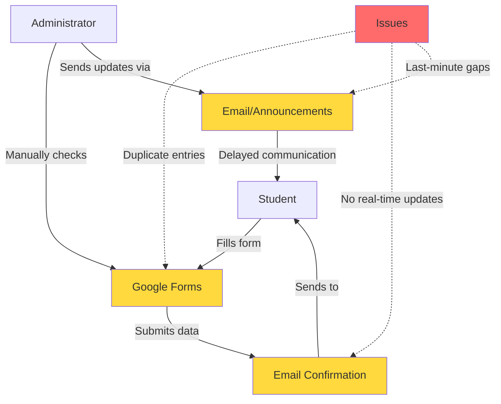

# Untitled

# Event Registration System Problem Analysis

## 📊 System Visualization

## 🔍 Problem Summary

The college's current event registration system relies on Google Forms and email confirmations, which creates several operational inefficiencies. Students experience frustration due to duplicate entries that aren't automatically detected, lack of real-time status updates on their registration status, and communication gaps that often surface at the last minute. This manual process places additional burden on administrators who must manually verify entries and send updates, leading to delays and potential errors in event management.

## ✅ Requirements for an Improved Event Registration System

1. **Duplicate Detection & Prevention:** The system should automatically detect and prevent duplicate registrations based on student ID or email, alerting users if they've already registered for an event.
2. **Real-Time Status Dashboard:** Provide students with a live dashboard where they can view their registration status, event capacity, waitlist position, and any updates instantly without relying on email.
3. **Automated Notification System:** Implement multi-channel notifications (email, SMS, in-app) that automatically send confirmations, reminders, cancellations, and last-minute updates to registered students.
4. **Centralized Database Management:** Create a unified database that stores all registration data, allowing administrators to easily track attendance, generate reports, manage capacity limits, and export data for analysis.
5. **Self-Service Management Portal:** Enable students to edit their registrations, cancel attendance, join waitlists, and update their contact information through a user-friendly interface without administrator intervention.